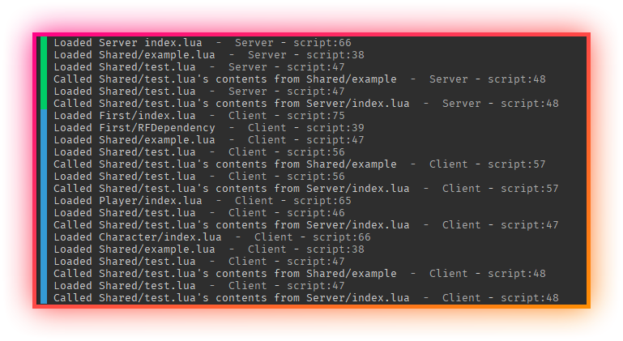

# What is this?

This directory contains all the scripts.

## How does it work?

On bundle (bundle.ps1/bundle.sh), the scripts are `luacc`-ed to the `rojo/Client`, `rojo/Server` and `rojo/Shared` directories. 
The `index.lua` files are entry points (`Client/[Character|First|Player]/index.lua`, `Server/index.lua`) for the scripts. Everything else

## `script.`

Avoid this. It will not work as you expect.

Use `game.<whatever>` instead.

## `require()`s

`require()`s work in the following syntax: `require('a/b')`. 
`a` is the name of a directory in `Client`, `Server` or `Shared`, depending on which you're working on.

## `Shared`

The `Shared` directory, on compilation, is copied to both `Client/[Character|First|Player]/Shared` and `Server/Shared`. 
For intelisense, it is kept there. Please do not edit files in there, as they will be replaced on re-copmilation. You can (and should), however, `require()` these.

Additionally, files in `Shared` must `require()` using `require('Shared/a/b')` instead of `require('a/b')`.

### Example Output

Given the current project structure & file contents, the following should be outputted to the console:

